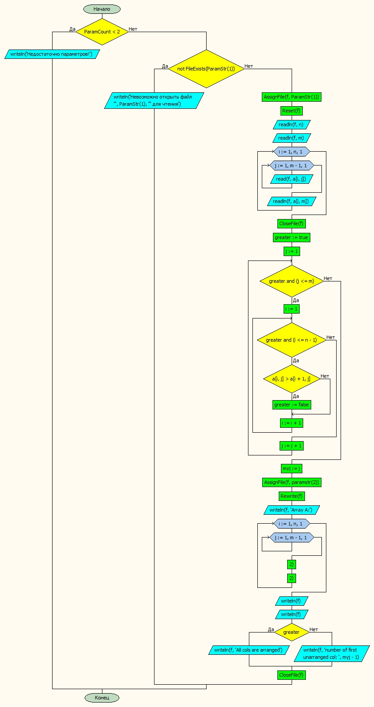

**_Чуворкин Михаил, группа А-14-19_**
# Лабораторная работа № 10

#### Постановка задачи.
Проверить, все ли столбцы матрицы упорядочены по возрастанию. Если не все, найти номер первого неупорядоченного столбца.


#### Таблица данных

Класс | Имя | Смысл | Тип | Структура |
---- | --- | ----- | --- | --------- |
Входные данные | a | обр. матрица | вещ | матрица |
Входные данные | n | кол-во строк | цел | прост. перем |
Входные данные | m | кол-во столбцов | цел | прост. перем |
Пром. данные | f | входной-выходной файл | текст. файл | файл |
Пром. данные | i | счетчик | цел | прост.перем |
Пром. данные | j | счетчик | цел | прост.перем |
Пром. данные | greater | флаг упорядоченности | лог | прост.перем |
Выходные данные | myj | первый неупорядоченный столбец | цел | прост.перем |

#### Входная форма
n
m
a11, a12, ..., a1m
..................
an1, an2, ..., anm
#### Выходная форма
Недостаточно параметров
Невозможно открыть файл для чтения
Array A:
All cols are arranged
number of first unarranged col
#### Аномалии
Недостаточно параметров
Невозможно открыть файл для чтения
#### Тестовые примеры
№ Теста | Входные данные | Ожидаемые результаты |
------- | -------------- | -------------------- |
1 | 5 <br>5<br>1 2 3 4 5<br>2 3 2 5 6<br>3 4 1 6 3<br>4 5 4 8 5<br>5 6 3 1 6  | number of first unarranged col: 3 |
2 | 5<br>5<br>1 2 3 4 5<br>2 3 4 5 6<br>3 4 5 6 7<br>4 5 6 8 8<br>5 6 7 9 9  | All cols are arranged |

#### Метод
Поднимаем флаг упорядоченности
В цикле по флагу и по столбцам создаем цикл по строкам и по флагу
Во внутреннем цикле проверяем больше ли текущий следующего
Если да, то опускаем флаг и выходим из двух циклов
Запоминаем номер столбца
#### Алгоритм


#### Программа
```pascal
// Проверить, все ли столбцы матрицы упорядочены по возрастанию. Если не все, найти номер первого неупорядоченного столбца.
program lab8_v30;

const
nmax = 20;

type
mas = array[1..nmax, 1..nmax] of real;
var
	// Входные данные
	a: mas;
	n,m: integer;
	// Промежуточные данные
	i,j, myj: integer;
	f:textfile;
	greater: boolean;
begin
if ParamCount < 2 then	              { Проверяем количество параметров }
	writeln('Недостаточно параметров!')
	else
	begin
 		if not FileExists(ParamStr(1)) then	      { Проверяем существование файла }
      		writeln('Невозможно открыть файл ''', ParamStr(1), ''' для чтения')
		else
		begin

{ #########-----Ввод исходных данных------################ }
  		AssignFile(f, ParamStr(1));	       { Открываем файл }
  		Reset(f);
  		readln(f, n);
		readln(f, m);
  		for i := 1 to n do begin
			for j := 1 to m-1 do
				read(f, a[i,j]);
			readln(f, a[i, m]);
		end;
		CloseFile(f);   { Закрываем файл }
        greater := true;
        j := 1;
        while greater and (j <= m) do begin
            i := 1;
            while greater and (i <= n-1) do begin
                if a[i,j] > a[i+1,j] then greater := false;
                i := i + 1;
            end;
            j := j + 1;
        end;
        myj := j;
        AssignFile(f, paramstr(2));
		Rewrite(f);
		writeln(f,'Array A:');
		for i := 1 to n do begin
			for j := 1 to m-1 do
				write(f, a[i,j]:6:2);
			writeln(f, a[i, m]:6:2);
		end;
		writeln(f); writeln(f);
        if greater then writeln(f,'All cols are arranged')
        else writeln(f, 'number of first unarranged col: ',myj-1);
        CloseFile(f);
        end;
    end;
end.
```
