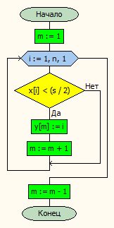
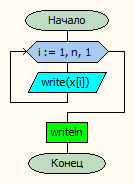
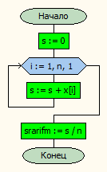
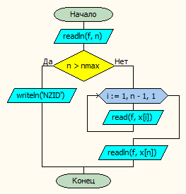
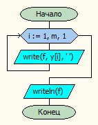

# Лабораторная работа № 11

#### Постановка задачи.
Даны три одномерных массива a, b и c разного размера. Для каждого из этих массивов сформировать массив, содержащий номера элементов исходного массива, которые меньше половины среднего арифметического значений исходного массива. Для формирования массива из номеров элементов, меньших половины среднего арифметического, использовать процедуру. Для ввода и вывода массивов также использовать процедуры.


#### Таблица данных
| Класс                | Имя               | Смысл                                       | Тип         | Структура         |
|----------------------|-------------------|---------------------------------------------|-------------|-------------------|
| Входные данные       | a<br>b<br>c       | Входные массивы                             | вещ.        | Одномерный массив |
| Выходные данные      | ay<br>by<br>cy    | Выходные массивы                            | вещ.        | Одномерный массив |
| Входные данные       | an<br>bn<br>cn    | Количество элементов в входном массиве      | цел.        | прост.перем       |
| Промежуточные данные | f                 | Файл ввода-вывода                           | текст. файл | файл              |
| Промежуточные данные | ayn<br>byn<br>cyn | Количество элементов в выходном массиве     | цел.        | прост.перем       |


#### Таблица данных подпрограмм

| Класс                | Имя  | Смысл                     | Тип            | Структура         |
|----------------------|------|---------------------------|----------------|-------------------|
| Промежуточные данные | i    | счетчик                   | цел.           | прост. перем.     |
| Промежуточные данные | f    | входной или выходной файл | текстовый файл | файл              |
| Промежуточные данные | s    | сумма элементов           | вещ.           | прост.перем.      |
| Выходные данные      | y    | выходной массив           | цел.           | одномерный массив |
| Входные данные       | x    | входной массив            | вещ.           | одномерный массив |
| Входные данные       | n    | размер входного массива   | цел.           | прост. перем.     |
| Выходные данные      | m    | размер выходного массива  | цел.           | прост. перем.     |

#### Входная форма
an
a1, a2, a3...
bn
b1, b2, b3...
cn
c1, c2, c3...
#### Выходная форма
Array \< array name\>:
\< array a \>
Arithmetic mean: \< sa \>
Indexes of numbers less than s/2:
  \< array ay \>
#### Аномалии
n > nmax (Неверно заданы исходные данные)
ParamCount < 2 (Недостаточно параметров)
not FileExists(ParamStr(1)) (Невозможно открыть файл для чтения)
#### Тестовые примеры
| № Теста | Входные данные                                                               | Ожидаемые результаты |
|---------|------------------------------------------------------------------------------|----------------------|
| 1       | <br>4<br><br>1 2 3 4<br><br>6<br><br>5 1 3 8 5 3<br><br>8<br>5 1 2 6 3 7 9 5 | Array A: <br>1 2 3 4 <br>Arithmetic mean: 2.5<br>Indexes of numbers less than s/2:<br>1 <br><br>Array B:<br>5 1 3 8 5 3 <br>Arithmetic mean: 4.16666666666667<br>Indexes of numbers less than s/2:<br>2 <br><br>Array C:<br>5 1 2 6 3 7 9 5 <br>Arithmetic mean: 4.75<br>Indexes of numbers less than s/2:<br>2 3  |

#### Метод
Вводим массивы.
Ищем среднее арифметическое в каждом
Формируем одномерные массивы с номерами элементов, меньшими, чем половина среднего арифметического
#### Алгоритм







#### Программа
```pascal
//Даны три одномерных массива a, b и c разного размера.
//Для каждого из этих массивов сформировать массив, содержащий номера элементов исходного массива,
//которые меньше половины среднего арифметического значений исходного массива.
//Для формирования массива из номеров элементов, меньших половины среднего арифметического, использовать процедуру.
//Для ввода и вывода массивов также использовать процедуры.
program lab11_v30;

const
nmax = 20;

type
mas = array[1..nmax] of real;


var
	// Входные данные
	a,b,c,ay,by,cy: mas;
	// Промежуточные данные
	an, bn, cn,ayn,byn,cyn: integer;
  sa, sb, sc: real;
	f:textfile;


procedure vvod(var x:mas;var n:integer; var f:textfile );
var i: integer;
begin
    readln(f, n);
    if n > nmax then writeln('NZID')
    else begin
        for i := 1 to n-1 do
            read(f,x[i]);
        readln(f,x[n]);
    end;
end;

procedure print(var x:mas; n:integer);
var i: integer;
begin
    for i := 1 to n do
        write(x[i]);
    writeln;
end;

function srarifm(var x:mas; n:integer):real;
var s: real;
    i: integer;
begin
    s := 0;
    for i:=1 to n do begin
        s := s + x[i];
    end;
    srarifm := s / n;
end;

procedure createvector(var x,y:mas; var s:real;var n,m:integer);
var i: integer;
begin
    m := 1;
    for i:=1 to n do begin
        if x[i] < (s/2) then begin
            y[m] := i;
            m := m + 1;
            end;
    end;
    m := m - 1;
end;


procedure writevector(var y:mas; m:integer;var f:textfile);
var i: integer;
begin
    for i:=1 to m do begin
        write(f, y[i], ' ');
    end;
    writeln(f);
end;


begin
if ParamCount < 2 then	              { Проверяем количество параметров }
	writeln('Недостаточно параметров!')
	else
	begin
 		if not FileExists(ParamStr(1)) then	      { Проверяем существование файла }
      		writeln('Невозможно открыть файл ''', ParamStr(1), ''' для чтения')
		else
		begin
        AssignFile(f, ParamStr(1));	       { Открываем файл }
        Reset(f);
        vvod(a,an,f);
        vvod(b,bn,f);
        vvod(c,cn,f);
        CloseFile(f);   { Закрываем файл }

  		  print(a, an);
        print(b, bn);
        print(c, cn);

        sa := srarifm(a,an);
        sb := srarifm(b,bn);
        sc := srarifm(c,cn);

        createvector(a,ay,sa,an,ayn);
        createvector(b,by,sb,bn,byn);
        createvector(c,cy,sc,cn,cyn);

        AssignFile(f, ParamStr(2));
        rewrite(f);

        writeln(f,'Array A:');
        writevector(a,an,f);
        writeln(f,'Arithmetic mean: ',sa);
        writeln(f,'Indexes of numbers less than s/2:');
        writevector(ay,ayn,f);
        writeln(f);

        writeln(f,'Array B:');
        writevector(b,bn,f);
        writeln(f,'Arithmetic mean: ',sb);
        writeln(f,'Indexes of numbers less than s/2:');
        writevector(by,byn,f);
        writeln(f);

        writeln(f,'Array C:');
        writevector(c,cn,f);
        writeln(f,'Arithmetic mean: ',sc);
        writeln(f,'Indexes of numbers less than s/2:');
        writevector(cy,cyn,f);
        CloseFile(f);
        end;
    end;
end.
```
