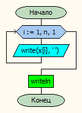
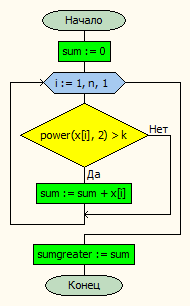
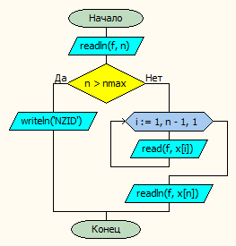
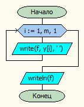

# Лабораторная работа № 12

#### Постановка задачи.
Даны три одномерных массива a, b и c разного размера. Какой из массивов имеет максимальную сумму элементов, квадрат величины которых больше заданного числа?

#### Таблица данных

| Класс                | Имя                | Смысл                                                                    | Тип         | Структура         |
|----------------------|--------------------|--------------------------------------------------------------------------|-------------|-------------------|
| Входные данные       | <br>a<br>b<br>c    | Входные массивы                                                          | вещ.        | Одномерный массив |
| Входные данные       | <br>an<br>bn<br>cn | Количество элементов в входном массиве                                   | цел.        | прост.перем.      |
| Промежуточные данные | f                  | Файл ввода-вывода                                                        | текст. файл | файл              |
| Промежуточные данные | <br>sa<br>sb<br>sc | сумма элементов массива, квадрат величины которых больше заданного числа | вещ.        | прост.перем.      |
| Входные данные       | k                  | заданное число                                                           | вещ.        | прост. перем.     |
| Промежуточные данные | arrayname          | имя массива                                                              | симв.       | прост. прем.      |

#### Таблица данных подпрограмм

| Класс                | Имя  | Смысл                     | Тип            | Структура         |
|----------------------|------|---------------------------|----------------|-------------------|
| Промежуточные данные | i    | счетчик                   | цел.           | прост. перем.     |
| Промежуточные данные | sum  | сумма                     | вещ.           | прост. перем.     |
| Промежуточные данные | f    | входной или выходной файл | текстовый файл | файл              |
| Входные данные       | x    | входной массив            | вещ.           | одномерный массив |
| Входные данные       | n    | размер входного массива   | цел.           | прост. перем.     |

#### Входная форма
\< k \> \
\< an \> \
a1, a2, a3... \
\< bn \> \
b1, b2, b3... \
\< cn \> \
c1, c2, c3... 
#### Выходная форма
In Array \< arrayname \>: \
\< элементы массива \>
#### Аномалии
an,bn,cn > nmax (Неверно заданы исходные данные) \
ParamCount < 2 (Недостаточно параметров) \
not FileExists(ParamStr(1)) (Невозможно открыть файл для чтения)
#### Тестовые примеры

| № Теста | Входные данные                                                               | Ожидаемые результаты |
|---------|------------------------------------------------------------------------------|----------------------|
| 1       | 30<br>5<br>1 1 3 10 12<br>6<br>11 12 13 4 22 5<br>4<br>5 5 10 5              | In Array B:58 <br>11 12 13 4 22 5   |
| 2       | 26<br>5<br>1 1 3 11 11<br>6<br>11 1 10 4 2 5<br>4<br>5 5 10 5                | In Array A:22 <br>1 1 3 11 11       |

#### Метод

Вводим массивы \
Находим суммы для каждого \
Находим из них максимальный \
Выводим нужный массив

#### Алгоритм






#### Программа
```pascal
//Даны три одномерных массива a, b и c разного размера.
//Какой из массивов имеет максимальную сумму элементов, квадрат величины которых больше заданного числа?
program lab12_v30;

const
nmax = 20;

type
mas = array[1..nmax] of real;


var
	// Входные данные
	a,b,c: mas;
	// Промежуточные данные
	an, bn, cn: integer;
  max,k,sa,sb,sc: real;
  arrayname : char;
	f:textfile;


procedure vvod(var x:mas;var n:integer; var f:textfile );
var i: integer;
begin
    readln(f, n);
    if n > nmax then writeln('NZID')
    else begin
        for i := 1 to n-1 do
            read(f,x[i]);
        readln(f,x[n]);
    end;
end;

procedure print(const x:mas; n:integer);
var i: integer;
begin
    for i := 1 to n do
        write(x[i], ' ');
    writeln;
end;

function sumgreater(const x:mas; n: integer; k: real):real;
var i: integer;
    sum: real;
begin
    sum := 0;
    for i := 1 to n do begin
        if power(x[i],2) > k then sum := sum + x[i];
    end;
    sumgreater := sum;
end;


procedure writevector(const y:mas; m:integer;var f:textfile);
var i: integer;
begin
    for i:=1 to m do begin
        write(f, y[i],' ');
    end;
    writeln(f);
end;


begin
if ParamCount < 2 then	              { Проверяем количество параметров }
	writeln('Недостаточно параметров!')
	else
	begin
 		if not FileExists(ParamStr(1)) then	      { Проверяем существование файла }
      		writeln('Невозможно открыть файл ''', ParamStr(1), ''' для чтения')
		else
		begin
        AssignFile(f, ParamStr(1));	       { Открываем файл }
        Reset(f);
        readln(f,k);
        vvod(a,an,f);
        vvod(b,bn,f);
        vvod(c,cn,f);
        CloseFile(f);   { Закрываем файл }

  		print(a, an);
        print(b, bn);
        print(c, cn);

        AssignFile(f, ParamStr(2));
        rewrite(f);
// =============== Нахождение максимального из трех ============
        sa := sumgreater(a,an,k);
        sb := sumgreater(b,bn,k);
        sc := sumgreater(c,cn,k);
        max := sa;
        arrayname := 'A';
        if sb > max then begin
            max := sb;
            arrayname := 'B';
            end;
        if sc > max then begin
            max := sc;
            arrayname := 'C';
            end;
// =============== Вывод  нужного массива ==========
        if arrayname = 'A' then begin
            print(a,an);
            writeln(f,'In Array A:',max);
            writevector(a,an,f);
            end;
        if arrayname = 'B' then begin
            print(b,bn);
            writeln(f,'In Array B:',max);
            writevector(b,bn,f);
            end;
        if arrayname = 'C' then begin
            print(c,cn);
            writeln(f,'In Array C:',max);
            writevector(c,cn,f);
            end;


        CloseFile(f);
        end;
    end;
end.
```
