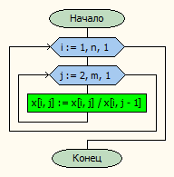

# Лабораторная работа № 13

#### Постановка задачи.
Для каждой из трёх матриц определить количество строк, в которых нет элементов, равных заданному числу. Если все строки матрицы не содержат элементов, равных заданному числу, разделить каждый элемент строки на предшествующий ему элемент. Первый элемент строки оставить без изменения.

#### Таблица данных

| Класс                | Имя                | Смысл                                                                    | Тип         | Структура         |
|----------------------|--------------------|--------------------------------------------------------------------------|-------------|-------------------|
| Входные данные       | <br>a<br>b<br>c    | Входные массивы                                                          | вещ.        | Одномерный массив |
| Входные данные       | <br>an<br>bn<br>cn | Количество строк в входном массиве                                       | цел.        | прост.перем.      |
| Входные данные       | <br>am<br>bm<br>cm | Количество столбцов в входном массиве                                    | цел.        | прост.перем.      |
| Промежуточные данные | f                  | Файл ввода-вывода                                                        | текст. файл | файл              |
| Промежуточные данные | <br>sa<br>sb<br>sc | сумма элементов массива, квадрат величины которых больше заданного числа | вещ.        | прост.перем.      |
| Входные данные       | k                  | заданное число                                                           | вещ.        | прост. перем.     |
| Промежуточные данные | arrayname          | имя массива                                                              | симв.       | прост. прем.      |

#### Входная форма
\<k\> \
\<an am\> \
Матрица A \
\<bn bm\> \
Матрица B \
\<cn cm\> \
Матрица C 
#### Выходная форма
*Для каждой матрицы* \
Матрица \
Количество строк, не содержащих число (Kol-vo = \< k \>) \
Матрица после деления(если необходимо)
#### Аномалии
an,bn,cn,am,bm,cm > nmax (Неверно заданы исходные данные) \
ParamCount < 2 (Недостаточно параметров) \
not FileExists(ParamStr(1)) (Невозможно открыть файл для чтения)
#### Тестовые примеры
*Входные данные* \
1 \
4 5 \
1 2 3 4 5 \
2 3 4 5 6 \
3 4 5 6 7 \
4 5 6 7 8 \
4 5 \
1 2 7 4 5 \
2 4 4 5 6 \
3 4 5 3 7 \
4 1 6 7 8 \
4 5 \
7 5 3 4 5 \
2 3 4 5 6 \
3 9 5 6 7 \
4 5 8 7 8 \
*Ожидаемые результаты* \
Matrix A Before: \
  1.00  2.00  3.00  4.00  5.00 \
  2.00  3.00  4.00  5.00  6.00 \
  3.00  4.00  5.00  6.00  7.00 \
  4.00  5.00  6.00  7.00  8.00 


Kol-vo = 3


Matrix A After: \
  1.00  2.00  3.00  4.00  5.00 \
  2.00  3.00  4.00  5.00  6.00 \
  3.00  4.00  5.00  6.00  7.00 \
  4.00  5.00  6.00  7.00  8.00 


###########################==========###########################


Matrix B Before: \
  1.00  2.00  7.00  4.00  5.00 \
  2.00  4.00  4.00  5.00  6.00 \
  3.00  4.00  5.00  3.00  7.00 \
  4.00  1.00  6.00  7.00  8.00 


Kol-vo = 2


Matrix B After: \
  1.00  2.00  7.00  4.00  5.00 \
  2.00  4.00  4.00  5.00  6.00 \
  3.00  4.00  5.00  3.00  7.00 \
  4.00  1.00  6.00  7.00  8.00


###########################==========###########################


Matrix C Before: \
  7.00  5.00  3.00  4.00  5.00 \
  2.00  3.00  4.00  5.00  6.00 \
  3.00  9.00  5.00  6.00  7.00 \
  4.00  5.00  8.00  7.00  8.00


Kol-vo = 4


Matrix C After: \
  7.00  0.71  4.20  0.95  5.25 \
  2.00  1.50  2.67  1.88  3.20 \
  3.00  3.00  1.67  3.60  1.94 \
  4.00  1.25  6.40  1.09  7.31


###########################==========###########################

#### Метод
Вводим матрицы \
Находим количество строк без заданного числа \
Если количество таких строк равно количеству строк в матрице, то выполняем деление на предыдущий элемент \
Выводим матрицу
#### Алгоритм



#### Программа
```pascal
// Для каждой из трёх матриц определить количество строк, в которых нет элементов, равных заданному числу.
// Если все строки матрицы не содержат элементов, равных заданному числу,
// разделить каждый элемент строки на предшествующий ему элемент. Первый элемент строки оставить без изменения.
program lab13_v30;
uses myio,mytypes,computing;

var
    a,b,c: mas;
    an,am,bn,bm,cn,cm: integer;
    num,k: real;

procedure doAll(var x:mas; var n,m:integer ;var fin,fout:textfile; var num:real;masname: char);
var k: real;
begin
    vvod(x,n,m,fin);
    writeln(fout,'Matrix ', masname ,' Before:');
    vivod(x,n,m,fout);
    writeln(fout); writeln(fout);
    k := kolvo(x,n,m,num);
    writeln(fout, 'Kol-vo = ',k);
    writeln(fout); writeln(fout);
    if k = n then devide(x,n,m);
    writeln(fout,'Matrix ', masname ,' After:');
    vivod(x,n,m,fout);
    writeln(fout); writeln(fout);
    writeln(fout,'###########################==========###########################');
    writeln(fout); writeln(fout);
end;

begin
if paramsExist and fExists then begin
    readln(fin,num);

    doAll(a,an,am,fin,fout,num,'A');
    doAll(b,bn,bm,fin,fout,num,'B');
    doAll(c,cn,cm,fin,fout,num,'C');

    end;
end.

```

#### Модуль ввода-вывода
```pascal
unit myio;

interface
uses mytypes;
var
    paramsExist, fExists: boolean;
    fin, fout: textfile;

procedure vvod(var x:mas;var n,m: integer;var f:textfile);
procedure vivod(const x:mas; n,m: integer;var f: textfile);

implementation

procedure vvod;
var i,j: integer;
begin
    readln(f,n,m);
    if (n>nmax) or (m> nmax) or (m<0) or (n<0) then writeln('NZID')
    else begin
        for i := 1 to n do begin
            for j := 1 to m-1 do
                read(f,x[i,j]);
            readln(f,x[i,m]);
            end;
        end;
end;

procedure vivod;
var i,j:integer;
begin
    for i := 1 to n do begin
        for j := 1 to m-1 do
            write(f,x[i,j]:6:2);
        writeln(f,x[i,m]:6:2);
        end;
end;

initialization
if ParamCount < 2 then	begin
	writeln('Недостаточно параметров!');
    paramsExist := false;
    end
else begin
    paramsExist := true;
    fExists := true;
    AssignFile(fin, ParamStr(1));
    Reset(fin);
    AssignFile(fout, ParamStr(2));
    Rewrite(fout);
    end;

finalization
if fExists then begin
    CloseFile(fin);
    CloseFile(fout);
    end;
end.
```

#### Вычислительный модуль
```pascal
unit computing;

interface
uses mytypes,myio;

function kolvo(const x:mas; const n,m:integer; num: real):integer;
procedure devide(const x:mas; const n,m:integer);


implementation

function kolvo:integer;
var i,j,r:integer;
    fl: boolean;

begin
    fl := true;
    r := 0;
    for i := 1 to n do begin
        j := 1;
        while fl and (j<=m) do begin
            if x[i,j] = num then begin
                fl := false;
            end;
            j := j + 1;
        end;
        if fl then r := r + 1;
        fl := true;
    end;
    kolvo := r;
end;

procedure devide;
var i,j: integer;
begin
    for i := 1 to n do begin
        for j := 2 to m do
            x[i,j] := x[i,j] / x[i,j-1];
    end;
end;


initialization

finalization
end.
```

#### Модуль пользовательских типов
```pascal
unit mytypes;

interface
    const nmax = 20;
    type mas = array[1..nmax, 1..nmax] of real;

implementation

end.
```
