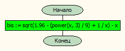
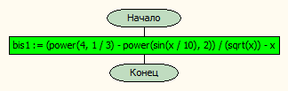
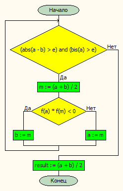
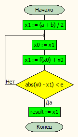
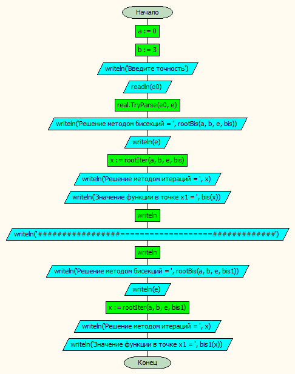

# Лабораторная работа №

#### Постановка задачи.
Разработать программу для приближенного нахождения корня уравнения f(x) = 0 на отрезке [a, b] с заданной точностью e. Корень уравнения находится двумя методами – методом деления отрезка пополам и методом простых итераций.
#### Таблица данных

Класс | Имя | Смысл | Тип | Структура |
---- | --- | ----- | --- | --------- |
Входные данные | e | точность | вещ. | прост. перем |
Промежуточные данные   | m | координата середины отрезка | вещ. | прост. перем |
Промежуточные данные | a,b | координаты краев отрезка  | вещ. | прост. перем |
Промежуточные данные | x0 | значение функции | вещ. | прост. перем |
Выходные данные | x1 | значение функции | вещ. | прост. перем |
Выходные данные | f | функция, для которой вычисляем корень | функциональный тип | функция |

#### Входная форма
Введите точность \{ e \}
#### Выходная форма
*Для каждой функции*
Решение методом бисекций = \{ a \}
Решение методом простых итераций = \{ x1 \}

#### Тестовые примеры
**Тест 1**
*Входные данные*
e = 0.000001
*Предполагаемые результаты*
Для функции 1:
Решение методом бисекций = 1.50039732456207
Решение методом итераций = 1.50039705508047
Значение функции в точке x1 = 3.50375125579561E-07

Для функции 2:
Решение методом бисекций = 1.35041177272797
Решение методом итераций = 1.35041185186692
Значение функции в точке x1 = -5.07510499625496E-07

**Тест 2**
*Входные данные*
e = 0.0001
*Предполагаемые результаты*
Для функции 1:
Решение методом бисекций = 1.50054931640625
Решение методом итераций = 1.5004223697101
Значение функции в точке x1 = -3.50420011165919E-05

Для функции 2:
Решение методом бисекций = 1.35044860839844
Решение методом итераций = 1.3503803675546
Значение функции в точке x1 = 4.74421047544915E-05


#### Метод
Объявляем начало и конец отрезка, на котором ищем корни
В цикле с предусловием вычисляем значение методом ледения пополам
В цикле с постусловием вычисляем значение методом простых итераций
Выводим значения и сравниваем их

#### Алгоритм







#### Программа
```pascal
program lab14_v30;

type
    func = function(const x:real):real;

function bis(x:real):real;
begin
    bis := sqrt( 1.96 - (power(x,3)/9) + 1/x ) - x;
end;

function bis1(x:real):real;
begin
    bis1 := (power(4,1/3) - power(sin(x/10),2))/(sqrt(x)) -x;
end;


function rootBis(a,b,e:real; f:func):real;
var m:real;
begin
    while (abs(a-b)>e) and (bis(a)>e) do begin
        m := (a + b) / 2;
        if f(a) * f(m) < 0 then b := m
        else a := m;
    end;
    result := (a + b) / 2
end;

function rootIter(a,b,e:real; f:func):real;
var x1,x0:real;
begin
    x1 := (a + b) / 2;
    repeat
        x0 := x1;
        x1 := f(x0) + x0;
    until abs(x0-x1)<e;
    result := x1;
end;


var e,a,b,x:real;
	e0:string;

begin
    a := 0;
    b := 3;

    writeln('Введите точность');
    readln(e0);
    real.TryParse(e0,e);

    writeln('Решение методом бисекций = ',rootBis(a,b,e,bis));
    writeln(e);

    x := rootIter(a,b,e,bis);
    writeln('Решение методом итераций = ',x);
    writeln('Значение функции в точке x1 = ', bis(x));
    writeln;
    writeln('#################===================#############');
    writeln;
    writeln('Решение методом бисекций = ',rootBis(a,b,e,bis1));
    writeln(e);

    x := rootIter(a,b,e,bis1);
    writeln('Решение методом итераций = ',x);
    writeln('Значение функции в точке x1 = ', bis1(x));
end.


```
