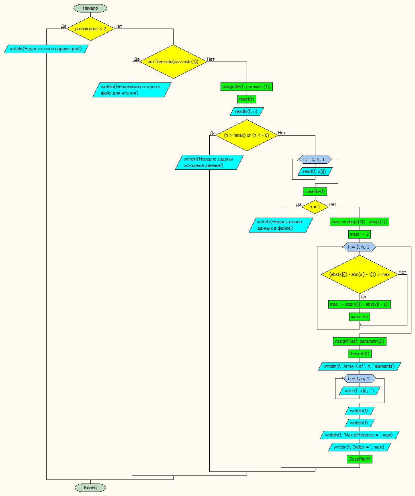

# Лабораторная работа № 6

#### Постановка задачи.
Определить максимальное значение среди выражений |Ai| – |Ai-1|

#### Таблица данных

Класс | Имя | Смысл | Тип | Структура |
---- | --- | ----- | --- | --------- |
Входные данные | x | входной массив | вещ. | массив |
Входные данные | n | кол-во эл-тов | цел. | прост. перем. |
Пром. данные | f | файл | текст. файл | файл |
Пром. данные | i | счетчик | цел. | прост. перем. |
Выходные данные | maxi | номер максимальной разницы | цел. | прост.перем. |
Выходные данные | max | максимальная разница | вещ. | прост.перем. |


#### Входная форма
n \
x1, x2, x3, ... xn \
#### Выходная форма
Недостаточно параметров \
Невозможно открыть файл для чтения \
Неверно заданы исходные данные \
Недостаточно данных в файле \
Array X of n elements \
Max difference = \
Index =
#### Аномалии
Недостаточно параметров \
Невозможно открыть файл для чтения \
Неверно заданы исходные данные (неверно указано количество элементов в массиве) \
Недостаточно данных в файле
#### Тестовые примеры
№ Теста | Входные данные | Ожидаемые результаты |
------- | -------------- | -------------------- |
1   |2.00     1.00     5.00     3.00     6.00   |Max difference =  4 <br> Index =  3|
2   |3.00     1.00     5.00     7.00    35.00     3.00     8.00|Max difference =  28 <br> Index =  5|

#### Метод
Вычисляем разницу первых двух элементов и считаем ее максимальной \
В цикле вычисляем разницу и сравниваем с максимальной \
Если она больше, то максимальной присваиваем текущее значение разницы \
Переходим к следующему ходу цикла
#### Алгоритм


#### Программа
```pascal
program lab6_var30;
const nmax = 100;
type mas=array[1..nmax] of real;

var x:mas;
	i,n,maxi:byte;
	max:real;
	f:textfile;


begin
	if paramcount < 2 then writeln('Недостаточно параметров')
	else begin
		if not fileexists(paramstr(1)) then writeln('Невозможно открыть файл для чтения')
		else begin
			assignfile(f,paramstr(1));
			reset(f);
			readln(f,n);

			if (n > nmax) or (n <= 0) then writeln('Неверно заданы исходные данные')
			else
			begin
				for i:=1 to n do
					read(f,x[i]);
				closefile(f);

				if n = 1 then writeln('Недостаточно данных в файле')
				else
				begin
					max := abs(x[2])-abs(x[1]);
					maxi := 2;
					for i:=3 to n do
						begin
							if (abs(x[i])-abs(x[i-1])) > max then
							begin
								max := abs(x[i])-abs(x[i-1]);
								maxi := i;
							end;
						end;


				AssignFile(f, paramstr(2));
				Rewrite(f);
				writeln(f, 'Array X of ', n:2, ' elements');
				for i := 1 to n do
					write(f, x[i]:8:2, ' ');
				writeln(f); writeln(f);
				writeln(f, 'Max difference = ', max:2);
				writeln(f, 'Index = ', maxi:2);
				CloseFile(f);
				end;
			end;
		end;
	end;
end.


```
