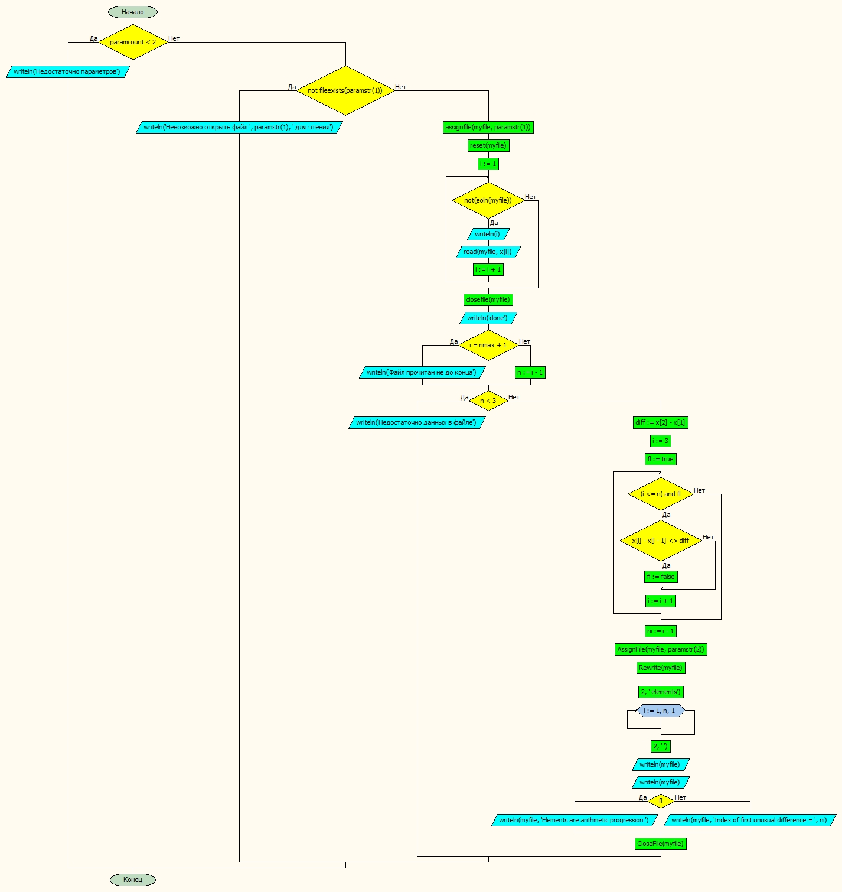

**_Чуворкин Михаил, группа А-14-19_**
# Лабораторная работа № 7

#### Постановка задачи.
Проверить, что элементы одномерного массива не образуют арифметическую прогрессию, т.е. не все пары элементов **xi** и **xi+1** имеют одинаковую разность. Если такая пара есть, найти её номер **i**.


#### Таблица данных

Класс | Имя | Смысл | Тип | Структура |
---- | --- | ----- | --- | --------- |
Входные данные | x | входной массив | вещ. | массив |
Пром. данные  | n | Количество эл-тов в массиве  | цел.   |  прост.перем |
Пром. данные  | i | счетчик | цел. | прост.перем |
Выходные данные  | ni | номер пары | цел. | прост.перем |
Пром. данные  | myfile | вх. и вых. файл | файл | файл |
Пром. данные | fl | флаг досрочного выхода | лог | прост. перем |


#### Входная форма
В файле:
x1, x2, ... xn


#### Выходная форма
Недостаточно параметров
Невозможно открыть файл для чтения
Недостаточно данных в файле
Elements are arithmetic progression
Index of first unusual difference =
#### Аномалии
Недостаточно параметров
Невозможно открыть файл для чтения
Недостаточно данных в файле
#### Тестовые примеры
№ Теста | Входные данные | Ожидаемые результаты |
------- | ------------- | -------------------- |
1.| 2.00     1.00     0.00     5.00     6.00 | 4 |
2.| 1.00     3.00     5.00     7.00     9.00 | Прогрессия |

#### Метод
Вычисляем разницу первых двух элементов
В цикле вычисляем разницу и сравниваем с исходной
Если она отличается, то выходим из цикла
#### Алгоритм


#### Программа
```pascal
program lab7_var30;
const nmax = 100;
type mas=array[1..nmax] of real;

var x:mas;
	i,n,ni:byte;
	diff:real;
	myfile:textfile;
   fl,flEoF: boolean;


begin
	if paramcount < 2 then writeln('Недостаточно параметров')
	else begin
		if not fileexists(paramstr(1)) then writeln('Невозможно открыть файл ',paramstr(1),' для чтения')
		else begin
			assignfile(myfile,paramstr(1));
			reset(myfile);
			i := 1;

			while not (eoln(myfile)) do begin
				writeln(i);
				read(myfile, x[i]);  //поменять на readln
				i := i + 1;
				end;
			closefile(myfile);
			writeln('done');
			if i = nmax + 1 then writeln('Файл прочитан не до конца')
			else n := i-1;
			if n < 3 then writeln('Недостаточно данных в файле')
			else begin
				diff := x[2] - x[1];
				i := 3;
				fl := true;
				while (i <= n) and fl do begin
					if x[i] - x[i-1] <> diff then fl := false;
					i := i + 1;
					end;
				ni := i - 1;
				AssignFile(myfile, paramstr(2));
				Rewrite(myfile);
				writeln(myfile, 'Array X of ', n:2, ' elements');
				for i := 1 to n do
					write(myfile, x[i]:8:2, ' ');
				writeln(myfile); writeln(myfile);

				if fl then writeln(myfile, 'Elements are arithmetic progression ')
				else writeln(myfile, 'Index of first unusual difference = ', ni);
				CloseFile(myfile);
			end;

		end;
	end;
end.

```
