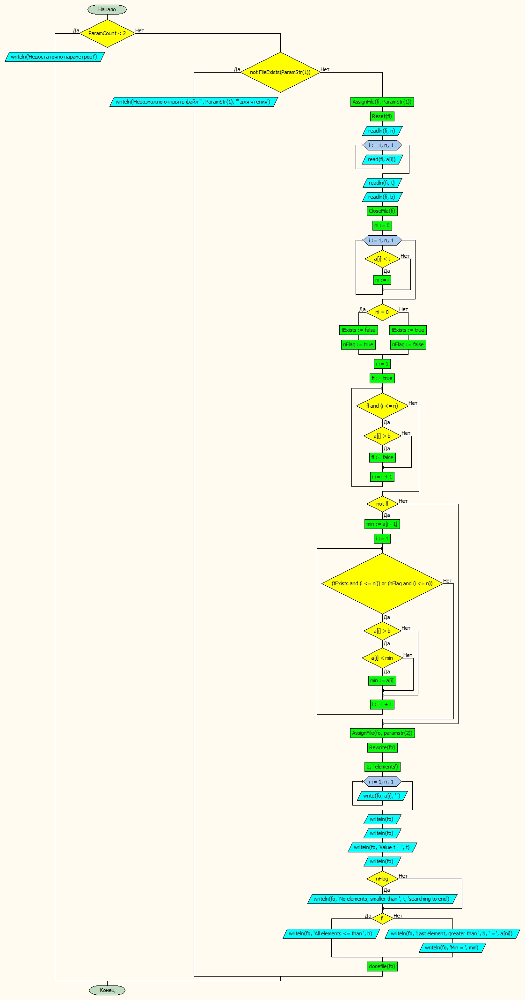

**_Чуворкин Михаил, группа А-14-19_**
# Лабораторная работа № 8

#### Постановка задачи.
 Задан целочисленный одномерный массив a из n элементов. Найти минимальный элемент среди элементов, больших b, расположенных до последнего элемента, меньшего t. Если нет элементов со значением, меньшим t, искать до конца массива.

#### Таблица данных

Класс | Имя | Смысл | Тип | Структура |
---- | --- | ----- | --- | --------- |
Входные данные | a | обр. массив | цел | массив |
Входные данные | n | размер массива | цел | прост. перем |
Входные данные | t | число t | цел | прост. перем |
Входные данные | b | число b | цел | прост. перем |
Пром. данные | i | счетчик | цел | прост.перем |
Пром. данные | ni | номер последнего эл-та, большего b | цел | прост.перем |
Пром. данные | tExists | флаг существования элементов, меньших t | лог | прост.перем |
Пром. данные | nFlag | флаг отсутствия элементов, меньших t | лог | прост.перем |
Пром. данные | fl | флаг остутствия элементов, больших b | лог | прост.перем |
Пром. данные | fi | входной файл | текст. файл | файл |
Пром. данные | fo | выходной файл | текст. файл | файл |
Выходные данные | min | минимальный элемент | цел | прост.перем |

#### Входная форма
n
a1, a2, a3, ..., an
t
b
#### Выходная форма
Недостаточно параметров!\
Невозможно открыть файл для чтения
Array A of elements:
a1, a2, a3, ..., an
Value t = t
Last element, greater than b =
No elements, greater than b searching to end
All elements <= than b
Min = min
#### Аномалии
Недостаточно параметров
Невозможно открыть файл для чтения
<br>
#### Тестовые примеры
№ Теста | Входные данные | Ожидаемые результаты |
------- | -------------- | -------------------- |
1| a[] = 1 2 3 4 5 6 7 8 9 10; t = 6; b = 2| Last element, greater than 2 = 5; Min = 3 |
2| a[] = 5 3 4 9 10 11; t = 8; b = 1| Last element, greater than 1 = 4; Min = 3 |
3| a[] = 5 3 5 9 7 3; t = 8; b = 13| All elements <= than 13 |
4| a[] = 5 3 5 9 7 3 ; t = 1; b = 13| No elements, smaller than 1, searching to end; All elements <= than 13 |

#### Метод
Найти последний элемент, меньший t
Проверить, существуют ли элементы меньше b
Найти минимальный
#### Алгоритм


#### Программа
```pascal
program lab8_v30;

const
nmax = 20;

type
mas = array[1..nmax] of integer;
var
	// Входные данные
	a: mas;
	n,t,b: integer;
	// Промежуточные данные
	imin, i, ni: integer;
	tExists, nFlag, fl: boolean;
	fi,fo:textfile;
	// Выходные данные
	min: integer;
begin
if ParamCount < 2 then	              { Проверяем количество параметров }
	writeln('Недостаточно параметров!')
	else
	begin
 		if not FileExists(ParamStr(1)) then	      { Проверяем существование файла }
      		writeln('Невозможно открыть файл ''', ParamStr(1), ''' для чтения')
		else
		begin

{ #########-----Ввод исходных данных------################ }
  		AssignFile(fi, ParamStr(1));	       { Открываем файл }
  		Reset(fi);
  		readln(fi, n);
  		for i := 1 to n do
    		read(fi, a[i]);
  		readln(fi, t);
	    readln(fi, b);
  		CloseFile(fi); 	                       { Закрываем файл }
			ni := 0;

			{ Ищем последний, меньший t}
			for i:=1 to n do
				if a[i] < t then ni := i;

			{ Если нет элементов меньших t}
			if ni = 0 then begin
				tExists := false;
				nFlag := true;
			end

			else begin
				tExists := true;
				nFlag := false;
			end;

			{проверяем, существуют ли элементы, меньше b}
			i := 1;
			fl := true;
			while fl and (i<=n) do begin
				if a[i]>b then fl := false;
				i := i+1;
			end;

			{Ищем минимальный}
			if not fl then begin
				min := a[i-1];
				i := 1;
				while (tExists and (i<=ni)) or (nFlag and (i<=n)) do begin
						if a[i]>b then
							if a[i] < min then min := a[i];
						i := i + 1;
				end;
			end;


			AssignFile(fo, paramstr(2));
			Rewrite(fo);
			writeln(fo,'Array A of ', n:2, ' elements');
			for i := 1 to n do
				write(fo, a[i], ' ');
			writeln(fo); writeln(fo);
			writeln(fo,'Value t = ',t);
			writeln(fo);

			if nFlag then writeln(fo,'No elements, smaller than ', t, 'searching to end');
			if fl then writeln(fo,'All elements <= than ', b)
			else begin
				writeln(fo,'Last element, greater than ', b, ' = ', a[ni]);
				writeln(fo,'Min = ', min);
			end;
			closefile(fo);
	end;
end;

end.

```
