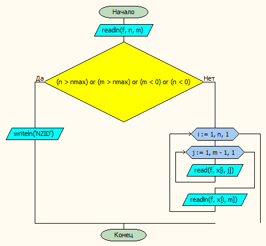

*Чуворкин Михаил А-14-19*
# Типовой расчет

#### Постановка задачи.
Для каждой из двух матриц поменять на обратный порядок элементов в тех строках, которые находятся выше строки, в которой максимальна сумма элементов, для которых значение f(x\[i,j]) положительно.
#### Таблица данных

| Класс          | Имя                | Смысл                                  | Тип  | Структура   |
|----------------|--------------------|----------------------------------------|------|-------------|
| Входные данные | <br>a<br>b         | Входные матрицы                        | вещ. | Матрица     |
| Входные данные | <br>an,am<br>bn,bm | Количество элементов в входном массиве | цел. | прост.перем |
#### Таблица данных подрограмм
| Класс                   | Имя      | Смысл                                  | Тип            | Структура    |
|-------------------------|----------|----------------------------------------|----------------|--------------|
| Входные-выходные данные | x        | Матрица                                | вещ.           | Матрица      |
| Входные-выходные данные | n,m      | Количество элементов в входном массиве | цел.           | прост.перем. |
| Промежуточные данные    | f        | функция                                | функциональный | функция      |
| Входные данные          | rowIndex | номер строки с максимумом              | цел.           | прост.перем. |
| Промежуточные данные    | k        | номер строки с максимумом              | цел.           | прост.перем. |

#### Входная форма
an, am
\< Матрица A>
bn, bm
\< Матрица B>
#### Выходная форма
Matrix A Before:
\< Матрица A >
Row Index with func1 = \<k1>
Matrix A After:
Row Index with func2 = \<k2>
Matrix A After:
#### Аномалии
an,bn,am,bm > nmax; an,bn,am,bm <= 0 (Неверно заданы исходные данные)
ParamCount < 2 (Недостаточно параметров)
not FileExists(ParamStr(1)) (Невозможно открыть файл для чтения)
#### Тестовые примеры
*Входные данные* \
4 5 \
2 2 1 1 1 \
1 2 1 2 2 \
2 1 5 2 4 \
-3 -3 -3 -3 -3 \
5 5 \
1.11 1.12 1.13 1.14 1.17 \
1 1 1 1.5 1 \
1.91 1.92 1.9 1.97 1.9 \
1.51 1.52 2.1 1.52 1.54 \
-1 2.1 2.1 3 -4 \
*Ожидаемые результаты*
Matrix A Before:
  2.00  2.00  1.00  1.00  1.00
  1.00  2.00  1.00  2.00  2.00
  2.00  1.00  5.00  2.00  4.00
 -3.00 -3.00 -3.00 -3.00 -3.00


Row Index with func1 = 3
Matrix A After:
  1.00  1.00  1.00  2.00  2.00
  2.00  2.00  1.00  2.00  1.00
  2.00  1.00  5.00  2.00  4.00
 -3.00 -3.00 -3.00 -3.00 -3.00


Row Index with func2 = 3
Matrix A After:
  1.00  1.00  1.00  2.00  2.00
  2.00  2.00  1.00  2.00  1.00
  2.00  1.00  5.00  2.00  4.00
 -3.00 -3.00 -3.00 -3.00 -3.00


###########################==========###########################


Matrix B Before:
  1.11  1.12  1.13  1.14  1.17
  1.00  1.00  1.00  1.50  1.00
  1.91  1.92  1.90  1.97  1.90
  1.51  1.52  2.10  1.52  1.54
 -1.00  2.10  2.10  3.00 -4.00


Row Index with func1 = 3
Matrix B After:
  1.17  1.14  1.13  1.12  1.11
  1.00  1.50  1.00  1.00  1.00
  1.91  1.92  1.90  1.97  1.90
  1.51  1.52  2.10  1.52  1.54
 -1.00  2.10  2.10  3.00 -4.00


Row Index with func2 = 5
Matrix B After:
  1.17  1.14  1.13  1.12  1.11
  1.00  1.50  1.00  1.00  1.00
  1.90  1.97  1.90  1.92  1.91
  1.54  1.52  2.10  1.52  1.51
 -1.00  2.10  2.10  3.00 -4.00


###########################==========###########################

#### Метод
Вводим матрицы
Ищем индекс строки, в которой максимальна сумма элементов, для которых значение f(xij) положительно.
Если нет такой строки, то выводим сообщение
Иначе меняем на обратный порядок элементов в строках, выше получившейся(для первой функции) и выводим матрицу
Если для первой функции было изменение порядка, то меняем обратно на первоначальный порядок и выполняем аналогичный алгоритм для второй функции
#### Алгоритм





#### Программа
```pascal
//Для каждой из двух матриц поменять на обратный порядок элементов в тех строках,
//которые находятся выше строки, в которой максимальна сумма элементов, для которых
//значение f(xij) положительно.
program lab13_v30;
uses myio,mytypes,computing;

var
    a,b: mas;
    an,am,bn,bm: integer;

procedure doAll(var x:mas; var n,m:integer ;var fin,fout:textfile;masname: char);
var k1,k2: integer;
begin
    vvod(x,n,m,fin);
    writeln(fout,'Matrix ', masname ,' Before:');
    vivod(x,n,m,fout);
    writeln(fout); writeln(fout);
    k1 := sumIndex(x,n,m,func1) - 1;
    writeln(fout, 'Row Index with func1 = ',k1+1);
    if k1 = 0 then writeln(fout, 'No row with func1(x) > 0')
    else begin
        reverse(x,n,m,k1);
        writeln(fout,'Matrix ', masname ,' After:');
        vivod(x,n,m,fout);
    end;
    writeln(fout); writeln(fout);
    k2 := sumIndex(x,n,m,func2) - 1;
    writeln(fout, 'Row Index with func2 = ',k2+1);
    if k2 = 0 then writeln(fout, 'No row with func2(x) > 0')
    else if (k1<>0) then begin
        reverse(x,n,m,k1);
        reverse(x,n,m,k2);
        writeln(fout,'Matrix ', masname ,' After:');
        vivod(x,n,m,fout);
        end
    else begin
        reverse(x,n,m,k2);
        writeln(fout,'Matrix ', masname ,' After:');
        vivod(x,n,m,fout);
    end;
    writeln(fout); writeln(fout);
    writeln(fout,'###########################==========###########################');
    writeln(fout); writeln(fout);
end;

begin
if paramsExist and fExists then begin
    doAll(a,an,am,fin,fout,'A');
    doAll(b,bn,bm,fin,fout,'B');
    end;
end.
```

#### Модуль ввода-вывода
```pascal
unit myio;

interface
uses mytypes;
var
    paramsExist, fExists: boolean;
    fin, fout: textfile;

procedure vvod(var x:mas;var n,m: integer;var f:textfile);
procedure vivod(const x:mas; n,m: integer;var f: textfile);

implementation

procedure vvod;
var i,j: integer;
begin
    readln(f,n,m);
    if (n>nmax) or (m> nmax) or (m<=0) or (n<=0) then writeln('NZID')
    else begin
        for i := 1 to n do begin
            for j := 1 to m-1 do
                read(f,x[i,j]);
            readln(f,x[i,m]);
            end;
        end;
end;

procedure vivod;
var i,j:integer;
begin
    for i := 1 to n do begin
        for j := 1 to m-1 do
            write(f,x[i,j]:6:2);
        writeln(f,x[i,m]:6:2);
        end;
end;

initialization
if ParamCount < 2 then	begin
	writeln('Недостаточно параметров!');
    paramsExist := false;
    end
else begin
    paramsExist := true;
    fExists := true;
    AssignFile(fin, ParamStr(1));
    Reset(fin);
    AssignFile(fout, ParamStr(2));
    Rewrite(fout);
    end;

finalization
if fExists then begin
    CloseFile(fin);
    CloseFile(fout);
    end;
end.
```
#### Модуль пользовательских типов
```pascal
unit mytypes;

interface
    const nmax = 20;
    type
        mas = array[1..nmax, 1..nmax] of real;
        func = function(const x:real):real;


implementation

end.
```

#### Вычислительный модуль
```pascal
unit computing;

interface
uses mytypes,myio;

function func1(x:real):real;
function func2(x:real):real;
function sumIndex(const x:mas; n,m:integer;f:func):integer;
procedure reverse(var x:mas;n,m:integer;rowIndex:integer);


implementation

function func1:real;
begin
    func1 := x;
end;


function func2:real;
begin
    func2 := power(x,2)-2*x;
end;

function sumIndex:integer;
var i,j,maxi:integer;
    max,sum: real;
begin
    max := 0;
    maxi := 0;
    for i := 1 to n do begin
        sum := 0;
        for j := 1 to m do begin
            if f(x[i,j]) > 0 then sum := sum + x[i,j];
        end;
        if sum > max then begin
            maxi := i;
            max := sum;
        end;
    end;
    sumIndex := maxi;
end;

procedure reverse;
var i,j:integer;
    tmp: real;
begin
    for i := 1 to rowIndex do begin
        for j := 1 to (m div 2) do begin
            tmp := x[i,m-j+1];
            x[i,m-j+1] := x[i,j];
            x[i,j] := tmp;
        end;
    end;
end;

initialization

finalization
end.
```
